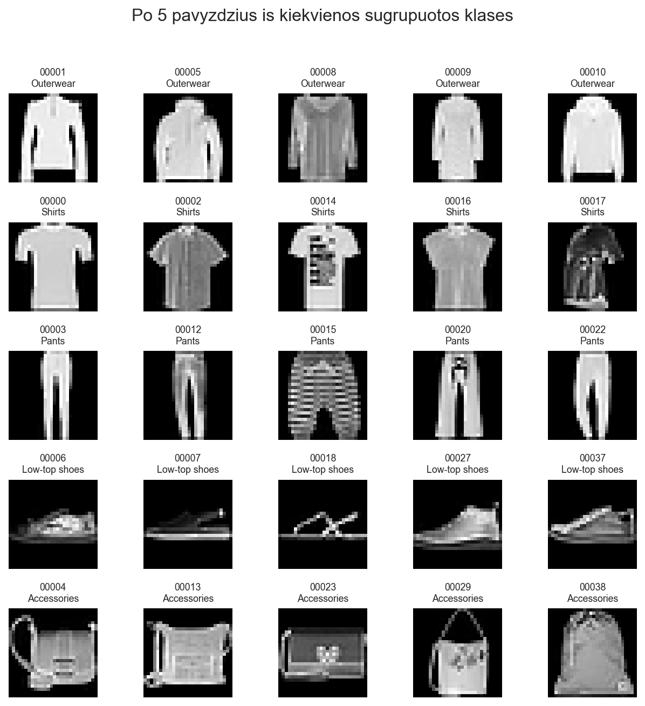
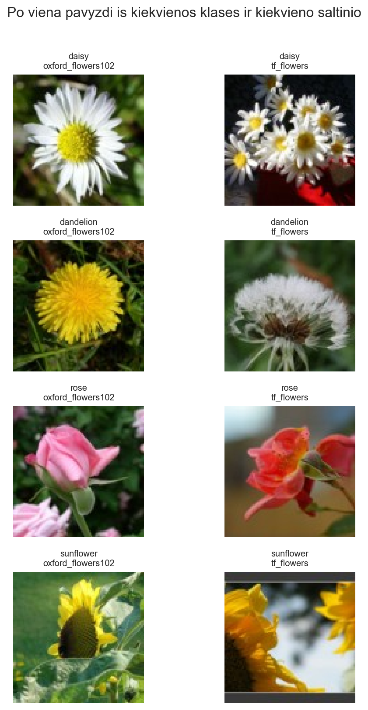
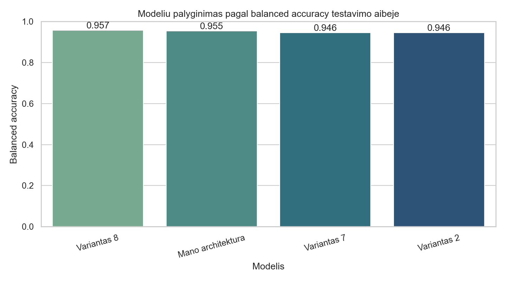
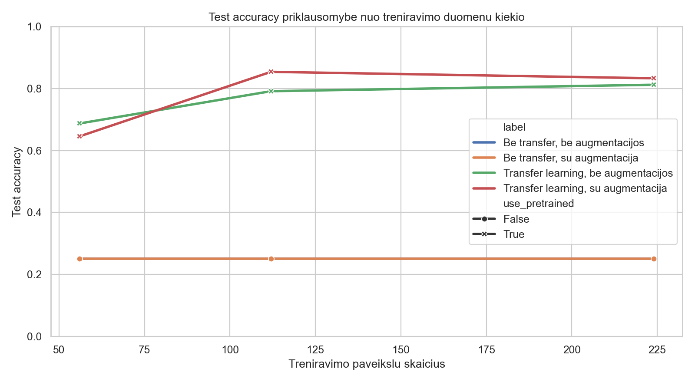
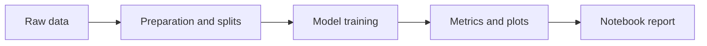
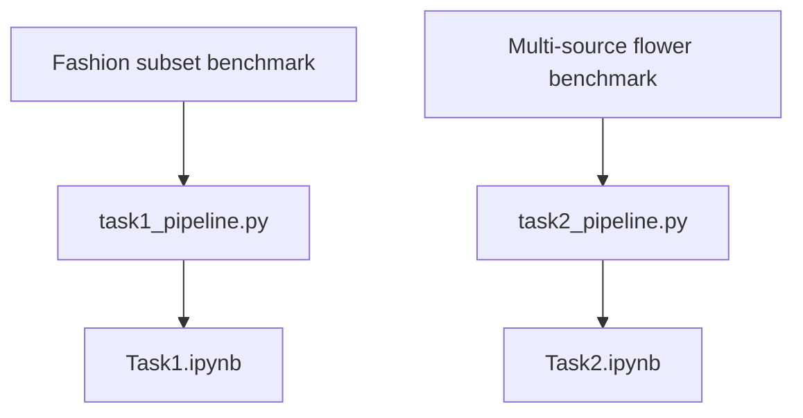

# DeepLearning

A compact computer vision project focused on reproducible image-classification experiments, custom dataset preparation, CNN benchmarking, and transfer learning.

The repository contains two end-to-end pipelines:

- a fashion-subset benchmark that compares multiple convolutional architectures;
- a multi-source flower classifier that measures the impact of transfer learning and data augmentation.

## Highlights

- Fully reproducible training pipelines for both experiments.
- Final report notebooks generated from code, not assembled by hand.
- Clean separation between source code, datasets, generated artifacts, and presentation assets.
- Lightweight GitHub layout with large files excluded from version control.

## Visual Snapshot

<p align="center">
  
  
</p>

<p align="center">
  
  
</p>

## Project Flow





## Experiment Overview

| Experiment | Focus | Best result |
| --- | --- | --- |
| Fashion subset CNN benchmark | Reference CNN variants vs custom architecture on a filtered fashion dataset | `balanced accuracy = 0.9574` |
| Reduced-sample analysis | Minimum practical sample size for stable performance | acceptable threshold: `30 000` images |
| Multi-source flower classification | Scratch vs pretrained models, with and without augmentation | `test accuracy = 0.8542` |

## Repository Layout

```text
DeepLearning/
|-- task1_pipeline.py
|-- build_task1_notebook.py
|-- Task1.ipynb
|-- task2_pipeline.py
|-- build_task2_notebook.py
|-- Task2.ipynb
|-- docs/
|   `-- images/
|-- requirements.txt
|-- .gitignore
`-- README.md
```

## Quick Start

### 1. Environment

```powershell
python -m venv .venv
.venv\Scripts\Activate.ps1
pip install -r requirements.txt
```

### 2. Fashion subset benchmark

Expected local dataset layout:

```text
LD2_dataset/
|-- labels.csv
`-- images/
    |-- 00000.png
    |-- 00001.png
    `-- ...
```

Run:

```powershell
python task1_pipeline.py
python build_task1_notebook.py
python -m nbconvert --to notebook --execute --inplace Task1.ipynb
```

### 3. Multi-source flower benchmark

The second pipeline builds its dataset automatically from external sources during execution.

Run:

```powershell
python task2_pipeline.py
python build_task2_notebook.py
python -m nbconvert --to notebook --execute --inplace Task2.ipynb
```

## Tech Stack

- `TensorFlow / Keras`
- `TensorFlow Datasets`
- `NumPy`
- `Pandas`
- `Matplotlib`
- `Seaborn`
- `Scikit-learn`
- `Pillow`
- `nbformat`
- `nbconvert`

## Reproducibility

The repository keeps only the lightweight, reproducible project surface: source code, notebooks, documentation, and selected README visuals. Datasets, caches, model weights, and generated artifacts are intentionally excluded through `.gitignore`.
