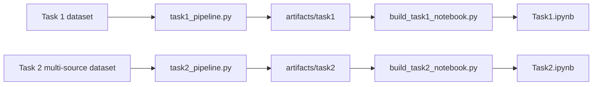
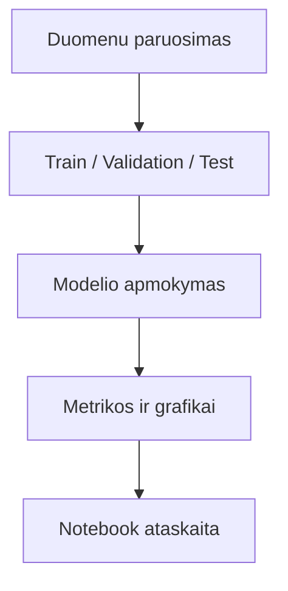

# DeepLearning

KTU giliojo mokymosi projektas su dviem praktinemis uzduotimis:

- `Task 1` - keliu CNN architekturu palyginimas vaizdu klasifikavimui.
- `Task 2` - individualiai suformuotas keliu saltiniu duomenu rinkinys ir `transfer learning` analize.

README paliktas trumpas ir patogus GitHub perziurai: kas yra repozitorijoje, kaip ji paleisti ir kokie svarbiausi rezultatai.

## Projekto vaizdas



## Kas yra repozitorijoje

```text
DeepLearning/
|-- task1_pipeline.py
|-- build_task1_notebook.py
|-- Task1.ipynb
|-- task2_pipeline.py
|-- build_task2_notebook.py
|-- Task2.ipynb
|-- requirements.txt
|-- .gitignore
`-- README.md
```

Trumpai:

- `task1_pipeline.py` ir `task2_pipeline.py` paleidzia visa eksperimentu logika.
- `build_task*_notebook.py` sugeneruoja ataskaitinius notebook failus.
- `Task1.ipynb` ir `Task2.ipynb` yra galutiniai darbo pateikimo failai.
- Dideli datasetai, cache, modeliai ir sugeneruoti artefaktai i GitHub nekeliauja.

## Rezultatu santrauka

| Uzduotis | Geriausias variantas | Esme |
| --- | --- | --- |
| Task 1 | `Variantas 8` | `balanced accuracy = 0.9574` |
| Task 1 | Mano architektura | `balanced accuracy = 0.9552` |
| Task 1 | Mazesne imtis | priimtina riba: `30 000` paveikslu |
| Task 2 | `Transfer learning + augmentation` | geriausias `test accuracy = 0.8542` su `50%` train imtimi |

## Darbo eiga



## Paleidimas

### 1. Aplinkos paruosimas

```powershell
python -m venv .venv
.venv\Scripts\Activate.ps1
pip install -r requirements.txt
```

### 2. Task 1

Lokalus duomenu rinkinys turi buti tokios struktros:

```text
LD2_dataset/
|-- labels.csv
`-- images/
    |-- 00000.png
    |-- 00001.png
    `-- ...
```

Paleidimas:

```powershell
python task1_pipeline.py
python build_task1_notebook.py
python -m nbconvert --to notebook --execute --inplace Task1.ipynb
```

### 3. Task 2

`Task 2` duomenys formuojami automatiskai is keliu saltiniu, todel repozitorijoje jie nelaikomi.

Paleidimas:

```powershell
python task2_pipeline.py
python build_task2_notebook.py
python -m nbconvert --to notebook --execute --inplace Task2.ipynb
```

## Kas ignoruojama per Git

I repozitorija pagal nutylejima neitraukiami:

- lokalus `LD2_dataset/` ir `task2_dataset/`;
- `artifacts/` su grafikais, modeliais ir lentelemis;
- `cache/`, `__pycache__/`, notebook checkpointai;
- virtualios aplinkos ir IDE failai;
- tarpiniai modeliu svoriai, log failai ir kiti sugeneruoti ML failai.

Tai leidzia laikyti repozitorija lengva ir atkartojama.

## Naudotos bibliotekos

- `TensorFlow / Keras`
- `TensorFlow Datasets`
- `NumPy`
- `Pandas`
- `Matplotlib`
- `Seaborn`
- `Scikit-learn`
- `Pillow`
- `nbformat`
- `nbconvert`

## Pastaba

Jei noretum i GitHub ikelti ir pasirinktas iliustracijas ar rezultatu failus, juos galima prideti ranka atskirai. Pagal nutylejima repo paliktas svarus: tik kodas, notebook'ai ir paleidimo instrukcija.
