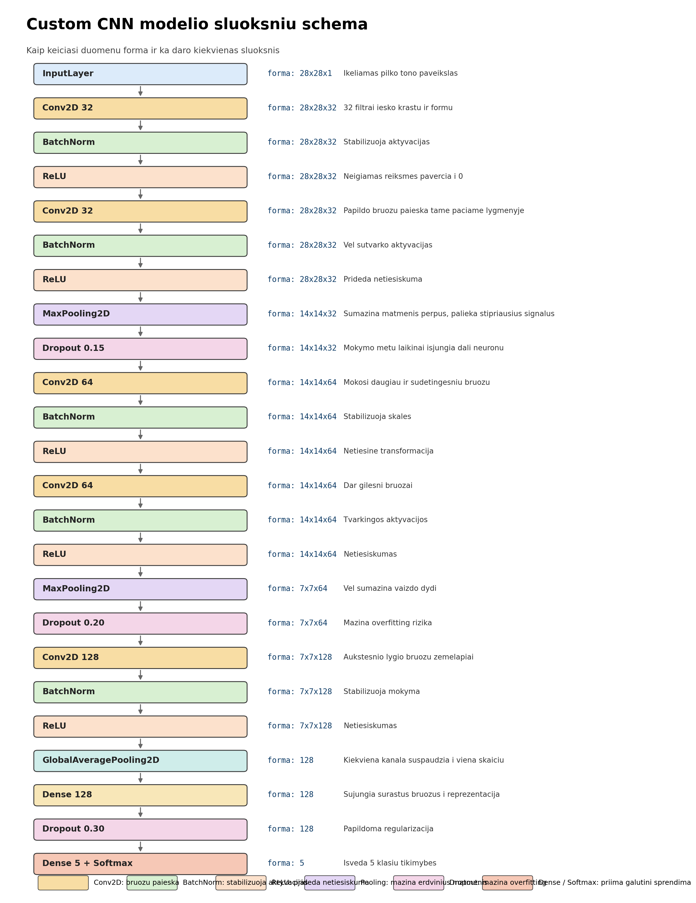

# Custom Model sluoksniu paaiskinimas

Sis failas paaiskina tavo `build_custom_model()` architektura is [task1_pipeline.py](c:/Users/jokub/Desktop/KTU/DeepLearning/task1_pipeline.py#L304).

## Visa modelio logika trumpai

Modelis daro 3 pagrindinius darbus:

1. `Conv2D` sluoksniai iesko vaizde bruozu, pvz. krastu, formu ir teksturu.
2. `Pooling` sluoksniai mazina vaizdo matmenis, kad modelis dirbtu greiciau ir labiau susitelktu i svarbiausia informacija.
3. Paskutiniai sluoksniai surenka surastus bruozus ir nusprendzia, kuriai klasei paveikslas priklauso.

## Vizualizacija

## Ka daro kiekvienas layer tipas

### `InputLayer`

- Priima pradine ivesti.
- Tavo atveju tai yra `28x28x1` paveikslas.
- `28x28` yra aukstis ir plotis, o `1` reiskia pilko tono kanala.

### `Conv2D`

- Tai svarbiausias CNN sluoksnis.
- Jis stumia maza filtra, pvz. `3x3`, per visa paveiksla.
- Kiekvienas filtras iesko tam tikro bruozu tipo:
  krastu, kampu, konturu, teksturu.
- Jei turi `Conv2D(32)`, tai reiskia, kad sluoksnis mokosi `32` skirtingu filtru.

Tavo modelyje:

- pirmi sluoksniai iesko paprastesniu bruozu;
- gilesni sluoksniai iesko sudetingesniu kombinaciju.

### `BatchNormalization`

- Normalizuoja sluoksnio isejimus.
- Padeda modelio mokymui buti stabilesniam.
- Dažnai leidzia mokytis greiciau ir mazina jautruma blogam masteliui.

Paprastai galvok taip:

- `Conv2D` isgauna signalus;
- `BatchNormalization` juos "sutvarko", kad sekantis sluoksnis gautu tvarkingesnius skaicius.

### `Activation("relu")`

- `ReLU` reiskia, kad neigiamos reiksmes paverciamos i `0`, o teigiamos paliekamos.
- Tai leidzia modeliui mokytis ne tiesiniu, o sudetingesniu rysiu.

Paprastai:

- be aktyvacijos keli sluoksniai butu per daug panasus i viena paprasta matematine funkcija;
- su `ReLU` tinklas tampa daug galingesnis.

### `MaxPooling2D`

- Mazina erdvinius matmenis.
- Pvz. is `28x28` gali padaryti `14x14`.
- Is kiekvieno mazo langelio palieka didziausia reiksme.

Tai naudinga, nes:

- sumazina skaiciavimu kieki;
- palieka stipriausius signalus;
- padeda modeliui maziau reaguoti i smulkius poslinkius.

### `Dropout`

- Mokymo metu atsitiktinai "isjungia" dali neuronu.
- Pvz. `Dropout(0.15)` reiskia, kad mazdaug 15% aktyvaciju laikinai nenaudojama.

Tai naudinga, nes:

- modelis maziau persimoko ant treniravimo aibes;
- jis buna priverstas mokytis tvirtesniu bruozu.

Svarbu:

- `Dropout` veikia mokymo metu;
- testavimo metu jis nebetaikomas.

### `GlobalAveragePooling2D`

- Pavercia kiekviena bruozu zemelapi i viena skaiciu.
- Jei pries ji turi `7x7x128`, po jo gausi `128`.

Ka tai reiskia:

- kiekvienam is 128 kanalu paimamas vidurkis;
- gaunamas trumpas ir kompaktiškas aprasas apie visa paveiksla.

Tai yra lengvesne alternatyva `Flatten`, nes:

- turi maziau parametru;
- mazina overfitting rizika.

### `Dense`

- Pilnai sujungtas sluoksnis.
- Jis sujungia visus surinktus bruozus i galutini sprendima.

Tavo modelyje:

- `Dense(128, relu)` dar sukuria tarpine reprezentacija;
- paskutinis `Dense(NUM_CLASSES, softmax)` pateikia klasiu tikimybes.

### `Softmax`

- Pavercia paskutinio sluoksnio skaicius i tikimybes.
- Visu klasiu tikimybes sudeda i `1`.

Pvz. modelis gali isvesti:

- `Outerwear = 0.05`
- `Shirts = 0.10`
- `Pants = 0.80`
- `Low-top shoes = 0.03`
- `Accessories = 0.02`

Tada pasirenkama klase su didziausia tikimybe.

## Kaip tavo modelyje kinta matmenys

- `Input`: `28x28x1`
- po pirmo `Conv2D`: `28x28x32`
- po antro `Conv2D`: `28x28x32`
- po `MaxPooling2D`: `14x14x32`
- po trecio `Conv2D`: `14x14x64`
- po ketvirto `Conv2D`: `14x14x64`
- po antro `MaxPooling2D`: `7x7x64`
- po penkto `Conv2D`: `7x7x128`
- po `GlobalAveragePooling2D`: `128`
- po `Dense(128)`: `128`
- po paskutinio `Dense(5, softmax)`: `5`

## Vienu sakiniu

Modelis pirmiausia ismoksta surasti naudingu bruozu zemelapius, tada juos suspaudzia i trumpa vektoriu, ir galiausiai nusprendzia, kuriai is 5 klasiu priklauso paveikslas.
